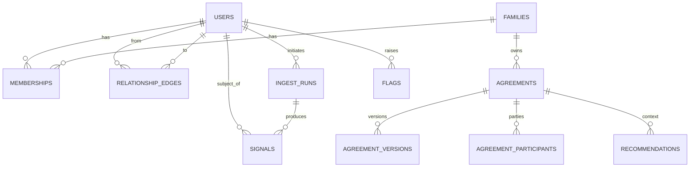

# MyChoice Alpha — Engineering Charter (Sprint 000)

**Repo:** `MyChoice-alpha001`
**Author:** Chief Engineer, MyChoice Alpha
**Status:** Working draft for Sprint 000 kickoff
**Date:** 2026-06-08

---

## 0. Purpose and how to read this

This is the engineering charter for the MyChoice Alpha. It converts two source documents into a buildable plan:

- **Master Specification** (`MyChoice / EgoGentix`, patent draft, 2026-06-04) — the conceptual and legal frame: Context Kernel, Relationship Graph, Signals, Family Agreement Objects, Contextualized Views, AI Mediation, Privacy/Security architecture.
- **Wiser Discovery Proposal** (`Y26`) — the alpha scope: 8–12 pilot families, GDPR/Instagram export ingestion, parent + child dashboards, agreement engine, AI-suggested actions, "Something Feels Weird?" flagging, COPPA/GDPR posture.

**Decisions already fixed for Alpha** (per direction):

- New repository. The existing MyChoice demo (Next.js 14, v0.2) is **reference only** — reuse product language, concepts, and selected UI ideas; **do not** carry over its architecture.
- Clean **Expo / React Native / TypeScript / Supabase** scaffolding.
- **Domain-first**: schemas and the governance model are the source of truth; UI and infra are downstream.
- Documentation + **ADRs** from day one.

**Governing constraints:** alpha for 8–12 families; GDPR export ingestion; parent dashboard; child dashboard; family agreement engine; AI recommendations; avoid premature optimization; minimize technical debt; **design for future EgoGentix compatibility but do not implement EgoGentix infrastructure during Alpha.**

The seven sections below are the requested deliverables: (1) repository structure, (2) canonical Signal schema, (3) canonical Agreement schema, (4) User/Family domain model, (5) recommended stack, (6) architecture risks, (7) Sprint 000 deliverables.

### The one principle that orders everything

The patent's load-bearing idea is **separation of raw activity from governed output**: parents see *patterns* (derived signals), never *content*; AI operates on derived signals + agreements, never raw content; every disclosure is the result of a governance decision, and decisions are audited (not content). Wiser restates this as the "zero-knowledge boundary."

For Alpha we implement this as an **enforced data boundary in Postgres + a single Policy Broker seam**, not as cryptography. That is the right amount of engineering for 8–12 families and is also the seam along which the future EgoGentix Context Kernel slots in without a rewrite.

---

## 1. Proposed repository structure

A light **pnpm workspace** monorepo. Domain logic is pure TypeScript with no I/O, so it is testable, portable, and reusable by both the Expo app and Supabase Edge Functions. We deliberately do **not** adopt Turborepo/Nx yet (premature for alpha; add later if build times warrant).

```
MyChoice-alpha001/
├── apps/
│   └── mobile/                     # Expo (React Native + TS). Single app, role-aware UI.
│       ├── app/                    # expo-router routes
│       │   ├── (auth)/             # sign-in, parental-consent, family join
│       │   ├── (parent)/           # Parent Contextualized View
│       │   ├── (child)/            # Minor Contextualized View
│       │   └── (shared)/           # Shared Family View, agreements
│       ├── src/
│       │   ├── features/           # screen-level feature modules
│       │   ├── components/         # app-specific composition
│       │   └── lib/                # supabase client, query hooks, session/role
│       └── app.config.ts
│
├── packages/
│   ├── domain/                     # ❶ SOURCE OF TRUTH. Pure types + Zod schemas.
│   │   ├── src/
│   │   │   ├── signal/             # Signal, SignalCategory, Transform metadata
│   │   │   ├── agreement/          # Agreement, AgreementVersion, AgreementRule
│   │   │   ├── identity/           # User, Family, Membership, Role, RelationshipEdge
│   │   │   ├── governance/         # VisibilityRule, Consent, Domain, PrivacyClass
│   │   │   ├── audit/              # AuditEvent, Provenance
│   │   │   └── index.ts
│   │   └── package.json
│   │
│   ├── governance-engine/          # Pure functions. Signal × Agreement → evaluation.
│   │   └── src/
│   │       ├── evaluate.ts         # evaluateAgreement(signals, agreement) → Alignment
│   │       ├── visibility.ts       # canView(viewerRole, object, context) — alpha policy
│   │       └── compileContext.ts   # ❷ EgoGentix SEAM (see §5.4). Stub today.
│   │
│   ├── parser/                     # GDPR/Instagram export → Signal[]. Deterministic.
│   │   ├── src/
│   │   │   ├── instagram/          # format adapters (versioned)
│   │   │   ├── transforms/         # registered derived-signal transforms
│   │   │   └── index.ts            # parse(export) → { signals, rawExclusionManifest }
│   │   └── fixtures/               # sample exports for tests (synthetic, no real PII)
│   │
│   ├── ui/                         # shared design-system primitives (RN)
│   └── config/                     # shared tsconfig / eslint / prettier
│
├── supabase/
│   ├── migrations/                 # SQL schema = compiled from packages/domain intent
│   ├── functions/                  # Edge Functions = Policy Broker boundary
│   │   ├── ingest-export/          # receive export, parse, emit signals, destroy raw
│   │   ├── ai-mediate/             # role-scoped AI over signals+agreements only
│   │   └── compile-context/        # seam stub returning a typed projection
│   ├── seed/                       # synthetic family for dev
│   └── config.toml
│
├── schemas/                        # human-facing canonical schema docs (SQL + JSON Schema)
├── docs/
│   ├── ENGINEERING_CHARTER.md      # this document
│   ├── adr/                        # Architecture Decision Records
│   ├── privacy/                    # ZK boundary def, data inventory, LINDDUN/STRIDE
│   └── runbooks/                   # crisis-response ("Something Feels Weird"), deletion
├── .github/workflows/              # CI: typecheck, lint, test
├── pnpm-workspace.yaml
└── package.json
```

**Why this shape**

- `packages/domain` is imported by the app, the engine, the parser, and the Edge Functions. One definition of `Signal` and `Agreement`, everywhere — the antidote to schema drift, which is the most common early debt.
- The **governance engine is pure** and has no database. It can be unit-tested exhaustively and later lifted into the Context Kernel runtime unchanged.
- **Edge Functions are the only place** raw export bytes are touched, and they are the only place that talks to the LLM. That makes the privacy boundary a small, reviewable surface.
- Reference-only treatment of the old repo is structural: nothing is ported; concepts re-enter through `packages/domain`.

---

## 2. Canonical Signal schema

A **Signal** is a derived, privacy-safe indicator about a person's digital behavior. Raw content is never a Signal and never sits next to one. Fields are drawn directly from the spec (§16 Signal Taxonomy, §9 Compiled Context Object, derived-signal transforms) and reduced to what Alpha needs while staying forward-compatible.

### 2.1 TypeScript (in `packages/domain`, defined with Zod → types inferred)

```ts
export const SignalCategory = z.enum([
  "attention_engagement",   // session duration, late-night, escalation
  "social_interaction",     // contact volume, withdrawal, new contacts
  "content_exposure",       // category concentration, harmful/educational
  "emotional_behavioral",   // sudden shifts, compulsive patterns
  "wellness",               // sleep disruption, schedule instability
  "safety",                 // unknown contact, grooming/bullying indicators
  "growth_development",     // goal completion, positive habits
  "composite",              // scores derived from other signals
]);

export const Domain = z.enum([
  "wellness", "social", "educational", "safety", "personal",
]); // visibility scoping; mirrors spec relationship-graph domains

export const PrivacyClass = z.enum([
  "derived_safe",   // OK to surface to authorized non-owner (e.g., parent)
  "sensitive",      // surface to subject only, or via escalation
]);

export const Signal = z.object({
  id: z.string().uuid(),
  family_id: z.string().uuid(),
  subject_user_id: z.string().uuid(),         // the person the signal is ABOUT
  category: SignalCategory,
  type: z.string(),                            // slug, e.g. "late_night_usage"
  value: z.number(),                           // normalized
  value_type: z.enum(["scalar", "score", "boolean", "categorical"]),
  unit: z.string().nullable(),                 // e.g. "minutes", "count", "0-100"

  window_start: z.string().datetime(),         // observation window
  window_end: z.string().datetime(),
  confidence: z.number().min(0).max(1),

  // Provenance (spec: every kernel item carries provenance)
  source_type: z.enum([
    "gdpr_export", "instagram_export", "device", "questionnaire", "derived",
  ]),
  ingest_run_id: z.string().uuid().nullable(),
  transform_id: z.string().nullable(),         // which registered transform produced it
  transform_version: z.string().nullable(),

  // Privacy boundary (spec: raw-data-exclusion manifest)
  privacy_class: PrivacyClass,
  domain: Domain,
  raw_excluded: z.literal(true),               // INVARIANT for alpha: always true
  raw_exclusion_note: z.string().nullable(),

  // Composite support
  composite_of: z.array(z.string().uuid()).nullable(),

  created_at: z.string().datetime(),
  expires_at: z.string().datetime().nullable(),
  metadata: z.record(z.unknown()).default({}),
});
export type Signal = z.infer<typeof Signal>;
```

### 2.2 Postgres (Supabase migration, abridged)

```sql
create type signal_category as enum (
  'attention_engagement','social_interaction','content_exposure',
  'emotional_behavioral','wellness','safety','growth_development','composite');
create type signal_domain as enum ('wellness','social','educational','safety','personal');
create type privacy_class as enum ('derived_safe','sensitive');

create table signals (
  id uuid primary key default gen_random_uuid(),
  family_id uuid not null references families(id) on delete cascade,
  subject_user_id uuid not null references users(id) on delete cascade,
  category signal_category not null,
  type text not null,
  value double precision not null,
  value_type text not null check (value_type in ('scalar','score','boolean','categorical')),
  unit text,
  window_start timestamptz not null,
  window_end timestamptz not null,
  confidence real not null check (confidence between 0 and 1),
  source_type text not null,
  ingest_run_id uuid references ingest_runs(id) on delete set null,
  transform_id text,
  transform_version text,
  privacy_class privacy_class not null default 'derived_safe',
  domain signal_domain not null default 'wellness',
  raw_excluded boolean not null default true check (raw_excluded = true), -- invariant
  raw_exclusion_note text,
  composite_of uuid[] ,
  created_at timestamptz not null default now(),
  expires_at timestamptz,
  metadata jsonb not null default '{}'
);
-- There is no `content` column here, by design. Raw content never enters this table.
```

### 2.3 Registered transform (the derived-signal contract, spec §16)

Each transform is metadata + a pure function. It is the only sanctioned path from raw → signal, and it emits a manifest proving raw exclusion.

```ts
export const SignalTransform = z.object({
  id: z.string(),                  // "sleep_disruption.v1"
  version: z.string(),
  input_source: z.enum(["instagram_export", "gdpr_export", "device", "signal"]),
  output_type: z.string(),         // "sleep_disruption_signal"
  feature_window: z.string(),      // e.g. "21:30-07:00 local"
  threshold: z.number().nullable(),
  min_events: z.number().default(0),   // below this → emit nothing
  signal_expiration: z.string().nullable(),
});
```

Example pipeline (verbatim from spec): `raw_device_events → session_intervals → late_night_usage_feature → sleep_disruption_signal`. The raw events stay inside the ingest boundary; only the final signal is persisted.

### 2.4 JSON example

```json
{
  "id": "0b1c…", "family_id": "fa01…", "subject_user_id": "ch01…",
  "category": "wellness", "type": "sleep_disruption", "value": 72, "value_type": "score",
  "unit": "0-100", "window_start": "2026-06-01T00:00:00Z", "window_end": "2026-06-07T23:59:59Z",
  "confidence": 0.78, "source_type": "instagram_export", "ingest_run_id": "ir55…",
  "transform_id": "sleep_disruption.v1", "transform_version": "1.0.0",
  "privacy_class": "derived_safe", "domain": "wellness",
  "raw_excluded": true, "raw_exclusion_note": "derived from session intervals; raw events destroyed post-parse",
  "composite_of": null, "created_at": "2026-06-08T09:00:00Z", "expires_at": null, "metadata": {}
}
```

---

## 3. Canonical Agreement schema

The **Family Agreement Object** is the governance heart of the product (spec §17; Wiser "agreement primitive as a permission layer / first-class domain object, rules as structured machine-evaluatable objects — not free text"). It is modeled as **agreement → versions → typed rules → participants/consent**, so it is auditable, evolvable, and machine-evaluatable from day one.

### 3.1 TypeScript

```ts
export const AgreementCategory = z.enum([
  "technology_usage","educational","wellbeing","communication","safety","autonomy",
]);

export const AgreementStatus = z.enum([
  "draft","proposed","active","suspended","archived","superseded",
]);

export const RuleOperator = z.enum([
  "lt","lte","gt","gte","between","eq","trend_increase","trend_decrease","within_window",
]);

// A single machine-evaluatable rule. Compared against Signals by the governance engine.
export const AgreementRule = z.object({
  id: z.string().uuid(),
  subject_signal_type: z.string().nullable(),   // e.g. "late_night_usage"
  subject_category: SignalCategory.nullable(),
  operator: RuleOperator,
  params: z.record(z.unknown()),                // { threshold: 30, unit: "minutes" } etc.
  window: z.string().nullable(),                // "weekday 21:30-07:00 local"
  weight: z.number().default(1),
  on_breach_intervention_level: z.number().int().min(1).max(6), // spec graduated intervention 1–6
  visibility_action: z.enum(["none","notify_subject","prompt_discussion","notify_guardian"]),
});

export const AgreementParticipant = z.object({
  user_id: z.string().uuid(),
  role_in_agreement: z.enum(["proposer","signer","observer"]),
  consent_state: z.enum(["pending","accepted","declined","withdrawn"]),
  signed_at: z.string().datetime().nullable(),
});

export const AgreementVersion = z.object({
  id: z.string().uuid(),
  agreement_id: z.string().uuid(),
  version_no: z.number().int(),
  human_text: z.string(),                       // "No screens 30 min before bedtime"
  rules: z.array(AgreementRule),                // machine-readable governance
  success_criteria: z.array(z.record(z.unknown())).default([]),
  autonomy_criteria: z.array(z.record(z.unknown())).default([]),
  escalation_rules: z.array(z.record(z.unknown())).default([]),
  created_by: z.string().uuid(),
  created_at: z.string().datetime(),
  supersedes_version_id: z.string().uuid().nullable(),
});

export const Agreement = z.object({
  id: z.string().uuid(),
  family_id: z.string().uuid(),
  title: z.string(),
  description: z.string().nullable(),
  category: AgreementCategory,
  status: AgreementStatus,
  current_version_id: z.string().uuid().nullable(),
  participants: z.array(AgreementParticipant),
  created_by: z.string().uuid(),
  created_at: z.string().datetime(),
  effective_at: z.string().datetime().nullable(),
  review_at: z.string().datetime().nullable(),
  expires_at: z.string().datetime().nullable(),
});
export type Agreement = z.infer<typeof Agreement>;
```

### 3.2 Lifecycle (spec §17 Agreement Formation / Evolution / Versioned Governance)

`draft → proposed → (all signers accept) → active → {suspended | superseded | archived}`. Edits never mutate an active version: they create a new `AgreementVersion` that `supersedes` the prior one. Old versions stay queryable for audit. A change to an active agreement is a **human-in-the-loop** action (spec §18) — AI may *suggest* an update, a participant must approve it.

### 3.3 Evaluation output (engine → views/AI)

`governance-engine.evaluateAgreement(signals, agreement)` returns a typed result, not a side effect:

```ts
export const AgreementAlignment = z.object({
  agreement_id: z.string().uuid(),
  state: z.enum(["aligned","at_risk","breached","insufficient_data"]),
  per_rule: z.array(z.object({
    rule_id: z.string().uuid(),
    state: z.enum(["aligned","at_risk","breached","insufficient_data"]),
    observed: z.number().nullable(),
    recommended_intervention_level: z.number().int().min(1).max(6).nullable(),
  })),
  alignment_score: z.number().min(0).max(100).nullable(), // feeds Family Alignment Score
});
```

This is what powers "this pattern appears inconsistent with the family's weekday sleep agreement" — a contextual, agreement-relative judgment rather than a generic threshold.

---

## 4. User / Family domain model

Modeled on the spec's Relationship Graph (§7) and Multi-Party Governance (§15), reduced to the Alpha's parent–child household, but with **authority carried on the relationship edge, not on the user** — so a person can be a guardian in one family and (later) something else elsewhere without contortions.

### 4.1 Entities

| Entity | Purpose |
|---|---|
| `users` | A person with an auth identity. No role here. |
| `families` | A household / governance unit (the "principal" at family scope). |
| `memberships` | **Edge**: user ↔ family + `role` + status. Authority lives here. |
| `relationship_edges` | Generalized graph edge (parent→child, future: physician, educator). Carries `domain`, `authority_rank`, `valid_from/to`. Alpha populates parent↔child only. |
| `data_sources` | A connected/ingested source for a subject (e.g., an Instagram export). |
| `ingest_runs` | One export-ingestion event. Holds **ephemeral** raw payload pointer + destroy timestamp. |
| `signals` | Derived indicators (see §2). |
| `agreements` / `agreement_versions` / `agreement_participants` | Governance objects (see §3). |
| `recommendations` | Role-scoped AI output (parent / child / shared), human-reviewable. |
| `flags` | "Something Feels Weird?" child-raised flags → crisis protocol. |
| `consents` | Verifiable parental consent + grant records (COPPA/GDPR). |
| `audit_events` | Decisions, disclosures, deletions — **never content**. |

### 4.2 Roles (Wiser RBAC, extended toward spec governance participants)

- `system_admin` — manage users / global settings (pilot operator).
- `guardian` (parent) — propose/sign/adjust agreements; view **derived** behavioral data for their children; **cannot** view raw content.
- `child` — propose/sign/adjust agreements; view **own** raw content **and** own patterns; raise flags.
- *Modeled but disabled in Alpha:* `professional` (educator/counselor/clinician) — domain-scoped, consent-gated. Present in the type system for EgoGentix compatibility; no UI, no grants issued.

### 4.3 Relationship diagram



### 4.4 Visibility matrix (the boundary, enforced by RLS)

| Object | Child (self) | Guardian (their child) | system_admin |
|---|---|---|---|
| Raw export content | ✅ own | ❌ **never** | ❌ |
| Derived `signals` (derived_safe) | ✅ own | ✅ | metadata only |
| Derived `signals` (sensitive) | ✅ own | escalation only | ❌ |
| Agreements / versions | ✅ party | ✅ party | ✅ |
| Recommendations (role-scoped) | ✅ child view | ✅ parent view | ❌ |
| Flags ("Feels Weird") | ✅ own | per crisis protocol | audit only |
| Audit events | own actions | own actions | ✅ |

Enforcement is **deny-by-default Postgres RLS** keyed on `memberships.role` and the relationship edge — visibility is governed independently of collection, exactly as the spec requires (§15 Trust-Based Visibility, §19 Visibility Determination). The contextualized views (§19) are then just role-appropriate *projections* of this same foundation.

---

## 5. Recommended stack for Alpha

Chosen to match the fixed direction and the constraints (8–12 families, minimize debt, no premature optimization). Rationale recorded as ADRs 0001–0004.

### 5.1 Client — Expo / React Native / TypeScript
- **Expo** (managed) + **expo-router** for file-based routing; one app, **role-aware** route groups (`(parent)`, `(child)`, `(shared)`) so parent and child get different Contextualized Views from one codebase. Satisfies Wiser's iOS+Android cross-platform NFR.
- **TypeScript strict**; **Zod** schemas from `packages/domain` validate every payload at the boundary.
- **TanStack Query** for server state; thin Supabase client in `apps/mobile/src/lib`.
- **EAS Build** for pilot distribution (TestFlight / internal Android). No app-store release — alpha is not GA.

### 5.2 Backend — Supabase
- **Postgres** with the domain schema + **Row-Level Security** as the governance enforcement layer for alpha. RLS *is* the alpha's Policy Broker for read paths.
- **Supabase Auth** — email OTP; parental-consent flow gates child accounts (COPPA verifiable consent, GDPR lawful basis).
- **Storage** — a short-retention bucket for uploaded GDPR/Instagram exports; objects destroyed immediately after parse (lifecycle + explicit delete).
- **Edge Functions (Deno/TS)** — the **Policy Broker boundary** and the only home for raw bytes and the LLM: `ingest-export`, `ai-mediate`, `compile-context`.

### 5.3 Ingestion + AI
- **Parser** (`packages/parser`): deterministic, fixture-driven, versioned per export format. Runs inside `ingest-export`; emits `Signal[]` + a raw-exclusion manifest; destroys the raw payload before returning. (On-device parsing is the spec's ideal "principal-controlled boundary"; for Alpha, server-side parse-and-destroy inside the Edge Function is the honest, shippable approximation — documented as such in `docs/privacy`.)
- **AI** (`ai-mediate`): server-side LLM (Claude) that receives **only** derived signals + agreement state + role, never raw content. Outputs are role-scoped (parent conversation-starters; child "something to think about"), constrained by agreement-aware guardrails, and **human-in-the-loop** for any governance change. No diagnosis; crisis terms route to the "Something Feels Weird" protocol.

### 5.4 The EgoGentix compatibility seam (design-for, don't-build)

One module — `governance-engine/compileContext.ts`, fronted by the `compile-context` Edge Function — is the single chokepoint for every cross-boundary disclosure. Today it returns a simple role-scoped projection backed by RLS. Tomorrow it becomes the spec's **Context Compiler** emitting a **Compiled Context Object** (§9). We keep the forward-compatible *shape* now:

```ts
// Alpha returns a thin projection; the field names anticipate the Compiled Context Object.
type ContextRequest = { consumer: string; purpose: string; domain: Domain; subject_user_id: string };
type CompiledProjection = {
  authorized_fields: string[];
  denied_fields: string[];
  derived_signals: Signal[];        // never raw
  obligations: string[];            // e.g. ["no_diagnosis","human_review_required"]
  audit_ref: string;
};
```

**Explicitly NOT built in Alpha** (premature for 8–12 families): cryptographic kernel & key hierarchies, multi-signature/delegated keys, TEE/enclaves, decentralized identifiers, the full overlay precedence lattice, revocation registry with key rotation, on-device kernel. We model provenance, `domain`, and `privacy_class` on every object so a future kernel can consume Alpha data unchanged — but the machinery stays out.

### 5.5 Tooling
pnpm workspaces · TypeScript strict · ESLint + Prettier · Vitest (engine/parser unit tests) · GitHub Actions CI (typecheck/lint/test on PR) · Supabase CLI + local stack · Conventional Commits. Minimal observability: Supabase logs + the `audit_events` table.

---

## 6. Architecture risks

| # | Risk | Sev | Mitigation |
|---|---|---|---|
| R1 | **Content leaks to a parent** via an RLS gap or a stray column — the existential product risk. | Critical | Deny-by-default RLS; raw content physically isolated (separate ephemeral path, never in `signals`); automated visibility test proving `guardian` cannot read raw rows; PR review gate on any RLS change. |
| R2 | **"Zero-knowledge" overpromise.** Supabase processes plaintext server-side during parse; true ZK is not achievable in Alpha. | High | Define ZK honestly in `docs/privacy` (parse-and-destroy, no raw at rest, derived-only persistence); set stakeholder expectations; record as ADR-0002; flag on-device parsing as the post-alpha path. |
| R3 | **GDPR/Instagram export format drift** breaks the parser. | High | Versioned format adapters; fixture corpus expanded each time a new export is seen; schema validation fails **closed** (no malformed signal persisted); parser is pure + unit-tested. |
| R4 | **COPPA verifiable parental consent & child data handling.** | High | Consent flow gating child accounts; role-gated access; right-to-deletion workflow (family exit / child reaches majority) with cascade deletes; retention config; consent records in `consents`. |
| R5 | **AI produces inappropriate, alarmist, or diagnostic output** — especially around a child flag. | High | Constrained prompts over derived signals only; agreement-aware guardrails; prohibited-language list (no diagnosis); human-in-the-loop for governance changes; crisis-response runbook for "Something Feels Weird"; log all sensitive outputs. |
| R6 | **Governance modeled as free text** instead of machine-evaluatable rules → rework + ambiguous enforcement. | Med | Typed `AgreementRule` from day one (§3); engine consumes structured rules; no free-text-driven decisions. |
| R7 | **Premature EgoGentix infrastructure** burns alpha runway. | Med | Compatibility *seam* only (§5.4); ADR-0004 records the explicit not-now list. |
| R8 | **Schema drift** between app, engine, and DB. | Med | Single `packages/domain` source of truth; SQL migrations reviewed against it; Zod at every boundary. |
| R9 | **Onboarding friction** for non-technical families doing a GDPR export. | Med | Guided in-app import; synthetic-data fallback (Wiser dependency) so the pilot isn't blocked on real exports. |
| R10 | **Identity/role edge cases** (multi-family, multi-child). | Low | Role on `memberships` edge, not on `users`; relationship edges generalize cleanly. |

---

## 7. Sprint 000 engineering deliverables

Foundation only — **no product features yet**. Goal: a clean, documented, CI-green skeleton where the domain, the boundary, and the seam exist and are tested. Each item has an acceptance criterion.

**Repo & CI**
- [ ] pnpm workspace bootstrapped; `apps/mobile` Expo app boots on iOS **and** Android simulators. *AC: `pnpm install && pnpm --filter mobile start` runs both targets.*
- [ ] GitHub Actions CI: typecheck + lint + test on every PR; branch protection on `main`. *AC: red CI blocks merge.*
- [ ] CONTRIBUTING.md, Definition of Done, Conventional Commits configured.

**Domain-first schemas**
- [ ] `packages/domain` published with Zod schemas for Signal, Agreement (+Version/Rule/Participant), User/Family/Membership/RelationshipEdge, Consent, AuditEvent. *AC: types inferred from Zod; no hand-written duplicates.*
- [ ] `supabase/migrations/0001_init.sql` creates all tables + enums consistent with `packages/domain`. *AC: `supabase db reset` applies cleanly.*
- [ ] **Deny-by-default RLS** baseline + first visibility policies (child-self, guardian-derived-only). *AC: visibility test (below) passes.*

**The boundary & the seam**
- [ ] `governance-engine` package: `evaluateAgreement()` + `canView()` + `compileContext()` stub with typed contracts. *AC: unit tests on fixtures, ≥1 per function.*
- [ ] Edge Function stubs: `ingest-export`, `ai-mediate`, `compile-context` returning typed responses. *AC: deploy locally; contract tests green.*
- [ ] `packages/parser`: one Instagram-export fixture → `Signal[]` for 2 signal types (`late_night_usage`, `content_volume`) + raw-exclusion manifest + parse-and-destroy contract. *AC: pure unit test; raw payload not present in output.*

**Privacy, safety, governance docs**
- [ ] `docs/privacy/zk-boundary.md` — realistic ZK definition + data inventory & classification table + retention/deletion policy.
- [ ] `docs/privacy/threat-model.md` — LINDDUN (privacy) + STRIDE (security) starters.
- [ ] `docs/runbooks/something-feels-weird.md` — crisis-response protocol: what the system does when a child raises a flag.
- [ ] ADRs merged: 0001 stack, 0002 privacy boundary, 0003 governance-as-first-class-domain, 0004 EgoGentix compatibility seam.

**Auth & seed**
- [ ] Auth skeleton: email OTP, family creation, guardian/child membership, **role-aware routing** (parent vs child shell) — no real data. *AC: a guardian and a child land on different shells.*
- [ ] **Visibility test harness**: automated proof that a `guardian` session cannot read raw content rows. *AC: test fails if RLS is loosened.*
- [ ] `supabase/seed`: one synthetic family (1 guardian, 1 child) for dev. *AC: seed runs in CI.*

**Exit criteria for Sprint 000:** the app boots on both platforms with role-aware shells; the domain schema is the single source of truth and is enforced by deny-by-default RLS; the parser produces signals without leaking raw content and a test proves it; the governance engine evaluates a sample agreement against sample signals; the four ADRs and the privacy/crisis docs are merged; CI is green.

---

## Appendix — traceability

| Deliverable | Spec source | Wiser source |
|---|---|---|
| Signal schema | §16 Signal Taxonomy; §9 Compiled Context Object; derived-signal transforms | Data parsing; ZK boundary |
| Agreement schema | §17 Family Agreement Objects; §15 governance | Agreement primitive as permission engine; machine-evaluatable rules |
| User/Family model | §7 Relationship Graph; §15 Multi-Party Governance; §19 Contextualized Views | User Roles (RBAC) |
| Stack | §14 System Architecture; §18 AI Mediation | Functional/NFR; AI deployment evaluation |
| Risks | §22 Privacy; §23 Security | Project Risks; LINDDUN/STRIDE; COPPA mapping |
| EgoGentix seam | §6 Context Kernel; §9 Context Compiler/Policy Broker | Future-proofed canonical schema |
