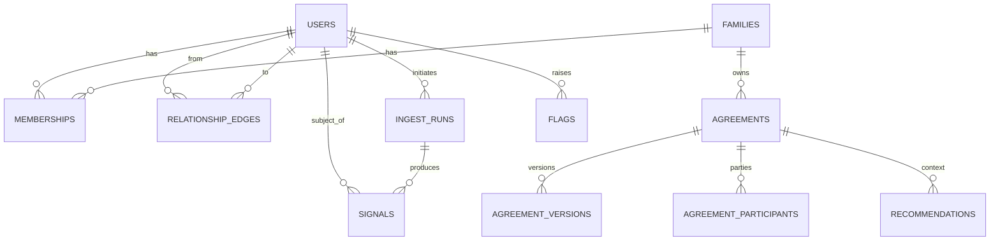

# MyChoice Alpha — Engineering Charter (Sprint 000)

**Repo:** `MyChoice-alpha001`
**Author:** Chief Engineer, MyChoice Alpha
**Status:** Accepted as engineering baseline (v1.1, pre-Sprint-001 amendments applied)
**Date:** 2026-06-08

> **v1.1 amendments** (accepted before Sprint 001): (1) `system_admin` renamed and narrowed to `pilot_operator`; (2) explicit deletion lifecycle added (§4.5, ADR-0005); (3) child raw-content access tightened to the active processing window only — Alpha does not persist raw social content after parsing. See ADR-0002 and ADR-0005.

---

## 0. Purpose and how to read this

This is the engineering charter for the MyChoice Alpha. It converts two source documents into a buildable plan:

- **Master Specification** (`MyChoice / EgoGentix`, patent draft, 2026-06-04) — the conceptual and legal frame: Context Kernel, Relationship Graph, Signals, Family Agreement Objects, Contextualized Views, AI Mediation, Privacy/Security architecture.
- **Wiser Discovery Proposal** (`Y26`) — the alpha scope: 8–12 pilot families, GDPR/Instagram export ingestion, parent + child dashboards, agreement engine, AI-suggested actions, "Something Feels Weird?" flagging, COPPA/GDPR posture.

**Decisions already fixed for Alpha** (per direction):

- New repository. The existing MyChoice demo (Next.js 14, v0.2) is **reference only** — reuse product language, concepts, and selected UI ideas; **do not** carry over its architecture.
- Clean **Expo / React Native / TypeScript / Supabase** scaffolding.
- **Domain-first**: schemas and the governance model are the source of truth; UI and infra are downstream.
- Documentation + **ADRs** from day one.

**Governing constraints:** alpha for 8–12 families; GDPR export ingestion; parent dashboard; child dashboard; family agreement engine; AI recommendations; avoid premature optimization; minimize technical debt; **design for future EgoGentix compatibility but do not implement EgoGentix infrastructure during Alpha.**

The seven sections below are the requested deliverables: (1) repository structure, (2) canonical Signal schema, (3) canonical Agreement schema, (4) User/Family domain model, (5) recommended stack, (6) architecture risks, (7) Sprint 000 deliverables.

### The one principle that orders everything

The patent's load-bearing idea is **separation of raw activity from governed output**: parents see *patterns* (derived signals), never *content*; AI operates on derived signals + agreements, never raw content; every disclosure is the result of a governance decision, and decisions are audited (not content). Wiser restates this as the "zero-knowledge boundary."

For Alpha we implement this as an **enforced data boundary in Postgres + a single Policy Broker seam**, not as cryptography. That is the right amount of engineering for 8–12 families and is also the seam along which the future EgoGentix Context Kernel slots in without a rewrite.

---

## 1. Proposed repository structure

A light **pnpm workspace** monorepo. Domain logic is pure TypeScript with no I/O, so it is testable, portable, and reusable by both the Expo app and Supabase Edge Functions. We deliberately do **not** adopt Turborepo/Nx yet (premature for alpha; add later if build times warrant).

```
MyChoice-alpha001/
├── apps/
│   └── mobile/                     # Expo (React Native + TS). Single app, role-aware UI.
│       ├── app/                    # expo-router routes
│       │   ├── (auth)/             # sign-in, parental-consent, family join
│       │   ├── (parent)/           # Parent Contextualized View
│       │   ├── (child)/            # Minor Contextualized View
│       │   └── (shared)/           # Shared Family View, agreements
│       └── src/                    # supabase client, query hooks, session/role
│
├── packages/
│   ├── domain/                     # ❶ SOURCE OF TRUTH. Pure types + Zod schemas.
│   ├── governance-engine/          # Pure functions. Signal × Agreement → evaluation; visibility; compileContext.
│   ├── parser/                     # GDPR/Instagram export → Signal[]. Deterministic.
│   ├── ui/                         # shared design-system primitives (RN)
│   └── config/                     # shared tsconfig / eslint / prettier
│
├── supabase/
│   ├── migrations/                 # SQL schema = compiled from packages/domain intent
│   ├── functions/                  # Edge Functions = Policy Broker boundary
│   │   ├── ingest-export/          # receive export, parse, emit signals, destroy raw
│   │   ├── ai-mediate/             # role-scoped AI over signals+agreements only
│   │   └── compile-context/        # seam stub returning a typed projection
│   └── seed/                       # synthetic family for dev
│
├── schemas/                        # human-facing canonical schema docs
├── docs/
│   ├── ENGINEERING_CHARTER.md      # this document
│   ├── adr/                        # Architecture Decision Records
│   ├── privacy/                    # ZK boundary def, data inventory, LINDDUN/STRIDE
│   └── runbooks/                   # "Something Feels Weird", deletion lifecycle
├── .github/workflows/              # CI: typecheck, lint, test
├── pnpm-workspace.yaml
└── package.json
```

**Why this shape**

- `packages/domain` is imported by the app, the engine, the parser, and the Edge Functions. One definition of `Signal` and `Agreement`, everywhere — the antidote to schema drift, which is the most common early debt.
- The **governance engine is pure** and has no database. It can be unit-tested exhaustively and later lifted into the Context Kernel runtime unchanged.
- **Edge Functions are the only place** raw export bytes are touched, and they are the only place that talks to the LLM. That makes the privacy boundary a small, reviewable surface.
- Reference-only treatment of the old repo is structural: nothing is ported; concepts re-enter through `packages/domain`.

---

## 2. Canonical Signal schema

A **Signal** is a derived, privacy-safe indicator about a person's digital behavior. Raw content is never a Signal and never sits next to one. Fields are drawn directly from the spec (§16 Signal Taxonomy, §9 Compiled Context Object, derived-signal transforms) and reduced to what Alpha needs while staying forward-compatible.

### 2.1 TypeScript (in `packages/domain`, defined with Zod → types inferred)

```ts
export const SignalCategory = z.enum([
  "attention_engagement", "social_interaction", "content_exposure",
  "emotional_behavioral", "wellness", "safety", "growth_development", "composite",
]);

export const Domain = z.enum(["wellness", "social", "educational", "safety", "personal"]);
export const PrivacyClass = z.enum(["derived_safe", "sensitive"]);

export const Signal = z.object({
  id: z.string().uuid(),
  family_id: z.string().uuid(),
  subject_user_id: z.string().uuid(),         // the person the signal is ABOUT
  category: SignalCategory,
  type: z.string(),                            // slug, e.g. "late_night_usage"
  value: z.number(),
  value_type: z.enum(["scalar", "score", "boolean", "categorical"]),
  unit: z.string().nullable(),
  window_start: z.string().datetime(),
  window_end: z.string().datetime(),
  confidence: z.number().min(0).max(1),
  source_type: z.enum(["gdpr_export", "instagram_export", "device", "questionnaire", "derived"]),
  ingest_run_id: z.string().uuid().nullable(),
  transform_id: z.string().nullable(),
  transform_version: z.string().nullable(),
  privacy_class: PrivacyClass,
  domain: Domain,
  raw_excluded: z.literal(true),               // INVARIANT for alpha: always true
  raw_exclusion_note: z.string().nullable(),
  composite_of: z.array(z.string().uuid()).nullable(),
  created_at: z.string().datetime(),
  expires_at: z.string().datetime().nullable(),
  metadata: z.record(z.unknown()).default({}),
});
export type Signal = z.infer<typeof Signal>;
```

### 2.2 Postgres (Supabase migration, abridged)

```sql
create table signals (
  id uuid primary key default gen_random_uuid(),
  family_id uuid not null references families(id) on delete cascade,
  subject_user_id uuid not null references users(id) on delete cascade,
  category signal_category not null,
  type text not null,
  value double precision not null,
  value_type text not null,
  unit text,
  window_start timestamptz not null,
  window_end timestamptz not null,
  confidence real not null check (confidence between 0 and 1),
  source_type text not null,
  ingest_run_id uuid references ingest_runs(id) on delete set null,
  transform_id text, transform_version text,
  privacy_class privacy_class not null default 'derived_safe',
  domain signal_domain not null default 'wellness',
  raw_excluded boolean not null default true check (raw_excluded = true), -- invariant
  raw_exclusion_note text, composite_of uuid[],
  created_at timestamptz not null default now(), expires_at timestamptz,
  metadata jsonb not null default '{}'
);
-- There is no `content` column here, by design. Raw content never enters this table.
```

### 2.3 Registered transform (the derived-signal contract, spec §16)

Each transform is metadata + a pure function — the only sanctioned path from raw → signal — and it emits a manifest proving raw exclusion. Example pipeline (verbatim from spec): `raw_device_events → session_intervals → late_night_usage_feature → sleep_disruption_signal`. Raw events stay inside the ingest boundary; only the final signal is persisted.

---

## 3. Canonical Agreement schema

The **Family Agreement Object** is the governance heart of the product (spec §17; Wiser "agreement primitive as a permission layer / first-class domain object, rules as structured machine-evaluatable objects — not free text"). It is modeled as **agreement → versions → typed rules → participants/consent**, so it is auditable, evolvable, and machine-evaluatable from day one.

```ts
export const RuleOperator = z.enum([
  "lt","lte","gt","gte","between","eq","trend_increase","trend_decrease","within_window",
]);

// A single machine-evaluatable rule. Compared against Signals by the governance engine.
export const AgreementRule = z.object({
  id: z.string().uuid(),
  subject_signal_type: z.string().nullable(),
  subject_category: SignalCategory.nullable(),
  operator: RuleOperator,
  params: z.record(z.unknown()),                // { threshold: 30, unit: "minutes" }
  window: z.string().nullable(),                // "weekday 21:30-07:00 local"
  weight: z.number().default(1),
  on_breach_intervention_level: z.number().int().min(1).max(6), // spec graduated intervention 1–6
  visibility_action: z.enum(["none","notify_subject","prompt_discussion","notify_guardian"]),
});

export const AgreementVersion = z.object({
  id: z.string().uuid(), agreement_id: z.string().uuid(), version_no: z.number().int(),
  human_text: z.string(), rules: z.array(AgreementRule),
  success_criteria: z.array(z.record(z.unknown())).default([]),
  autonomy_criteria: z.array(z.record(z.unknown())).default([]),
  escalation_rules: z.array(z.record(z.unknown())).default([]),
  created_by: z.string().uuid(), created_at: z.string().datetime(),
  supersedes_version_id: z.string().uuid().nullable(),
});

export const Agreement = z.object({
  id: z.string().uuid(), family_id: z.string().uuid(), title: z.string(),
  description: z.string().nullable(), category: AgreementCategory, status: AgreementStatus,
  current_version_id: z.string().uuid().nullable(), participants: z.array(AgreementParticipant),
  created_by: z.string().uuid(), created_at: z.string().datetime(),
  effective_at: z.string().datetime().nullable(), review_at: z.string().datetime().nullable(),
  expires_at: z.string().datetime().nullable(),
});
```

**Lifecycle** (spec §17): `draft → proposed → (all signers accept) → active → {suspended | superseded | archived}`. Edits never mutate an active version: they create a new `AgreementVersion` that supersedes the prior one; old versions stay queryable for audit. Changing an active agreement is **human-in-the-loop** (spec §18) — AI may suggest, a participant must approve.

**Evaluation** (`governance-engine.evaluateAgreement`) returns a typed `AgreementAlignment` (`aligned | at_risk | breached | insufficient_data`) per rule, feeding a Family Alignment Score — a contextual, agreement-relative judgment, not a generic threshold.

---

## 4. User / Family domain model

Modeled on the spec's Relationship Graph (§7) and Multi-Party Governance (§15), reduced to the Alpha's parent–child household, but with **authority carried on the relationship edge, not on the user** — so a person can be a guardian in one family and (later) something else elsewhere without contortions.

### 4.1 Entities

| Entity | Purpose |
|---|---|
| `users` | A person with an auth identity. No role here. |
| `families` | A household / governance unit (the "principal" at family scope). Carries a lifecycle `status`. |
| `memberships` | **Edge**: user ↔ family + `role` + status. Authority lives here. |
| `relationship_edges` | Generalized graph edge (parent→child, future: physician, educator). Carries `domain`, `authority_rank`, `valid_from/to`. Alpha populates parent↔child only. |
| `data_sources` / `ingest_runs` | A connected source + one export-ingestion event (raw payload **ephemeral**, with `raw_destroyed_at`). |
| `signals` | Derived indicators (see §2). |
| `agreements` / `agreement_versions` / `agreement_participants` | Governance objects (see §3). |
| `recommendations` | Role-scoped AI output (parent / child / shared), human-reviewable. |
| `flags` | "Something Feels Weird?" child-raised flags → crisis protocol. |
| `consents` | Verifiable parental consent + grant records (COPPA/GDPR). |
| `deletion_receipts` | Content-free receipts retained after deletion (see §4.5). |
| `audit_events` | Decisions, disclosures, deletions — **never content**. |

### 4.2 Roles (Wiser RBAC, extended toward spec governance participants)

- `pilot_operator` — a **narrow operational** role for running the pilot. **May:** manage pilot setup, support account recovery, inspect audit **metadata**, and trigger the deletion workflow. **May not:** view raw export content, view family signal/agreement content, or impersonate family members. This is deliberately **not** a product-authority "god-mode" role.
- `guardian` (parent) — propose/sign/adjust agreements; view **derived** behavioral data for their children; **cannot** view raw content.
- `child` — propose/sign/adjust agreements; access **their own uploaded source files during the active processing window only** (Alpha does **not** persist raw social content after parsing); view **own derived patterns**; raise flags.
- *Modeled but disabled in Alpha:* `professional` (educator/counselor/clinician) — domain-scoped, consent-gated. Present in the type system for EgoGentix compatibility; no UI, no grants issued.

### 4.3 Relationship diagram



### 4.4 Visibility matrix (the boundary, enforced by RLS)

| Object | Child (self) | Guardian (their child) | pilot_operator |
|---|---|---|---|
| Raw source files | ✅ own — **processing window only**; not persisted after parse | ❌ **never** | ❌ |
| Derived `signals` (derived_safe) | ✅ own | ✅ | ❌ |
| Derived `signals` (sensitive) | ✅ own | escalation only | ❌ |
| Agreements / versions | ✅ party | ✅ party | ❌ |
| Recommendations (role-scoped) | ✅ child view | ✅ parent view | ❌ |
| Flags ("Feels Weird") | ✅ own | per crisis protocol | ❌ |
| Audit events | own actions | own actions | ✅ **metadata only** |

Enforcement is **deny-by-default Postgres RLS** keyed on `memberships.role` and the relationship edge — visibility is governed independently of collection (spec §15 Trust-Based Visibility, §19 Visibility Determination). `pilot_operator` is intentionally absent from every content row; it sees only audit metadata. The contextualized views (§19) are role-appropriate *projections* of this same foundation.

### 4.5 Deletion and account lifecycle

Two lifecycle flows are first-class and must exist before Sprint 001 touches real family data. Full procedure in `docs/runbooks/deletion-lifecycle.md`; rationale in ADR-0005.

**Family exit — `family_exit_requested`:**

1. **Freeze ingestion** — no new exports parsed (`families.status: active → exit_requested → frozen`).
2. **Export derived data if requested** — a portable bundle of signals, agreements, and recommendations (never raw content).
3. **Delete raw processing artifacts** — any in-flight export objects; confirm `ingest_runs.raw_destroyed_at`.
4. **Delete signals / agreements / recommendations** — cascade from `families`.
5. **Preserve a minimal deletion audit receipt** — who/when/scope and record *counts only*, no content, in `deletion_receipts`.

**Child reaches majority — `child_reaches_majority`:**

1. **Suspend guardian default visibility** — set `valid_to = now()` on the `guardian_of` relationship edge(s); guardian access does not silently resume.
2. **Request adult re-consent** from the now-adult user.
3. **Offer the adult a choice** — export, delete, or continue as an **independent** self-owned account.

---

## 5. Recommended stack for Alpha

Chosen to match the fixed direction and constraints (8–12 families, minimize debt, no premature optimization). Rationale in ADRs 0001–0005.

### 5.1 Client — Expo / React Native / TypeScript
Expo (managed) + expo-router with role-aware route groups (`(parent)`, `(child)`, `(shared)`) — one app, two Contextualized Views, iOS + Android (Wiser cross-platform NFR). TypeScript strict; Zod from `packages/domain` validates payloads at the boundary. TanStack Query for server state. EAS Build for pilot distribution; no GA release.

### 5.2 Backend — Supabase
Postgres + **Row-Level Security** as the governance enforcement layer (RLS *is* the alpha's Policy Broker for read paths). Supabase Auth (email OTP + parental-consent gating). Storage (short-retention export bucket; objects destroyed immediately after parse). Edge Functions (Deno/TS) as the Policy Broker boundary and the only home for raw bytes and the LLM.

### 5.3 Ingestion + AI
Deterministic, fixture-driven, versioned **parser** runs inside `ingest-export`; emits `Signal[]` + a raw-exclusion manifest; destroys the raw payload before returning (on-device parsing is the spec ideal, deferred past Alpha). **AI** (`ai-mediate`) receives only derived signals + agreement state + role, never raw content; role-scoped outputs; agreement-aware guardrails; human-in-the-loop for governance changes; no diagnosis; crisis terms route to the "Something Feels Weird" protocol.

### 5.4 The EgoGentix compatibility seam (design-for, don't-build)
One module — `governance-engine/compileContext.ts`, fronted by the `compile-context` Edge Function — is the single chokepoint for every cross-boundary disclosure. Today it returns a role-scoped projection backed by RLS; tomorrow it becomes the spec's Context Compiler emitting a Compiled Context Object (§9). **Explicitly NOT built in Alpha:** cryptographic kernel & key hierarchies, multi-sig/delegated keys, TEE/enclaves, decentralized identifiers, the full overlay precedence lattice, revocation registry with key rotation, on-device kernel. Provenance, `domain`, and `privacy_class` on every object keep Alpha data consumable by a future kernel unchanged.

### 5.5 Tooling
pnpm workspaces · TypeScript strict · ESLint + Prettier · Vitest · GitHub Actions CI · Supabase CLI · Conventional Commits. Minimal observability: Supabase logs + `audit_events`.

---

## 6. Architecture risks

| # | Risk | Sev | Mitigation |
|---|---|---|---|
| R1 | **Content leaks to a parent** via an RLS gap or a stray column. | Critical | Deny-by-default RLS; no content column anywhere; automated visibility test proving a guardian cannot read raw rows; PR review gate on any RLS change. |
| R2 | **"Zero-knowledge" overpromise** — Supabase processes plaintext during parse. | High | Honest ZK definition (`docs/privacy`); parse-and-destroy; derived-only persistence; ADR-0002; on-device parsing as post-alpha path. |
| R3 | **GDPR/Instagram export format drift** breaks the parser. | High | Versioned adapters; growing fixture corpus; schema validation fails closed; pure, unit-tested parser. |
| R4 | **COPPA consent & child data handling**, incl. exit and majority. | High | Consent flow; role gating; **explicit deletion lifecycle (§4.5, ADR-0005)** for family-exit and child-majority; cascade deletes + content-free receipts; retention config. |
| R5 | **AI produces inappropriate / diagnostic output**, esp. around a flag. | High | Constrained prompts over derived signals; agreement-aware guardrails; no-diagnosis list; human-in-the-loop; crisis runbook; log sensitive outputs. |
| R6 | **Governance modeled as free text** → rework + ambiguity. | Med | Typed `AgreementRule` from day one (ADR-0003). |
| R7 | **Premature EgoGentix infrastructure** burns runway. | Med | Compatibility *seam* only (ADR-0004). |
| R8 | **Schema drift** between app, engine, DB. | Med | Single `packages/domain` source of truth; Zod at every boundary. |
| R9 | **Onboarding friction** for non-technical families. | Med | Guided import; synthetic-data fallback. |
| R10 | **Identity/role edge cases** (multi-family, multi-child, majority transition). | Low | Role on the membership edge; relationship edges with temporal validity. |

---

## 7. Sprint 000 engineering deliverables

Foundation only — **no product features yet**. Each item has an acceptance criterion.

**Repo & CI**
- [ ] pnpm workspace bootstrapped; `apps/mobile` Expo app boots on iOS **and** Android. *AC: `pnpm --filter mobile start` runs both targets.*
- [ ] CI: typecheck + lint + test on every PR; branch protection on `main`. *AC: red CI blocks merge.*
- [ ] CONTRIBUTING.md, Definition of Done, Conventional Commits.

**Domain-first schemas**
- [ ] `packages/domain` Zod schemas for Signal, Agreement(+Version/Rule/Participant), User/Family/Membership/RelationshipEdge, Consent, Flag, FamilyStatus, DeletionReceipt, AuditEvent. *AC: types inferred from Zod; no duplicates.*
- [ ] `supabase/migrations` create all tables + enums consistent with `packages/domain`. *AC: `supabase db reset` applies cleanly.*
- [ ] **Deny-by-default RLS** baseline + first visibility policies (child-self, guardian-derived-only, pilot_operator audit-only). *AC: visibility test passes.*

**The boundary & the seam**
- [ ] `governance-engine`: `evaluateAgreement()` + `canView()` + `compileContext()` with typed contracts. *AC: unit tests per function (verified — 10 passing).*
- [ ] Edge Function stubs: `ingest-export`, `ai-mediate`, `compile-context`. *AC: deploy locally; contract tests green.*
- [ ] `packages/parser`: Instagram fixture → `Signal[]` (`late_night_usage`, `content_volume`) + raw-exclusion manifest + parse-and-destroy. *AC: pure unit test proves no raw payload in output.*

**Privacy, safety, governance docs**
- [ ] `docs/privacy/zk-boundary.md`, `docs/privacy/threat-model.md` (LINDDUN + STRIDE).
- [ ] `docs/runbooks/something-feels-weird.md` — crisis-response protocol.
- [ ] `docs/runbooks/deletion-lifecycle.md` — family-exit + child-majority flows.
- [ ] ADRs merged: 0001 stack, 0002 privacy boundary, 0003 governance-as-domain, 0004 EgoGentix seam, 0005 deletion lifecycle + role narrowing.

**Auth, lifecycle & seed**
- [ ] Auth skeleton: email OTP, family creation, guardian/child membership, **role-aware routing** — no real data. *AC: guardian and child land on different shells.*
- [ ] **Visibility test harness**: automated proof a guardian cannot read raw content. *AC: test fails if RLS is loosened.*
- [ ] **Deletion lifecycle** implemented: `family_exit` (freeze → export → delete raw → delete derived → receipt) and `child_reaches_majority` (suspend guardian visibility → re-consent → export/delete/continue). *AC: a test family can be fully exited leaving only a content-free `deletion_receipts` row.*
- [ ] `supabase/seed`: one synthetic family (1 guardian, 1 child). *AC: seed runs in CI.*

**Exit criteria for Sprint 000:** app boots on both platforms with role-aware shells; the domain schema is the single source of truth enforced by deny-by-default RLS; the parser produces signals without leaking raw content and a test proves it; the engine evaluates a sample agreement; the deletion lifecycle is implemented and tested; ADRs 0001–0005 and the privacy/crisis/deletion docs are merged; CI is green.

---

## Appendix — traceability

| Deliverable | Spec source | Wiser source |
|---|---|---|
| Signal schema | §16; §9; derived-signal transforms | Data parsing; ZK boundary |
| Agreement schema | §17; §15 | Agreement primitive as permission engine |
| User/Family model | §7; §15; §19 | User Roles (RBAC) |
| Stack | §14; §18 | Functional/NFR; AI deployment evaluation |
| Risks | §22; §23 | Project Risks; LINDDUN/STRIDE; COPPA mapping |
| EgoGentix seam | §6; §9 | Future-proofed canonical schema |
| Deletion lifecycle | §10 portability/revocation; §22 | COPPA/GDPR deletion & retention |
